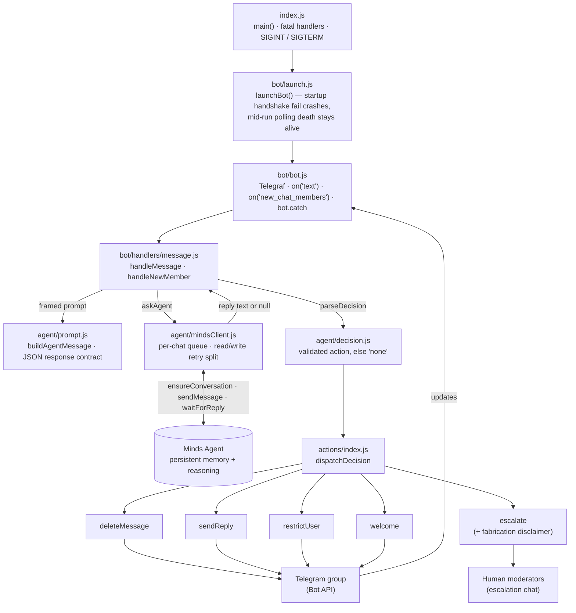
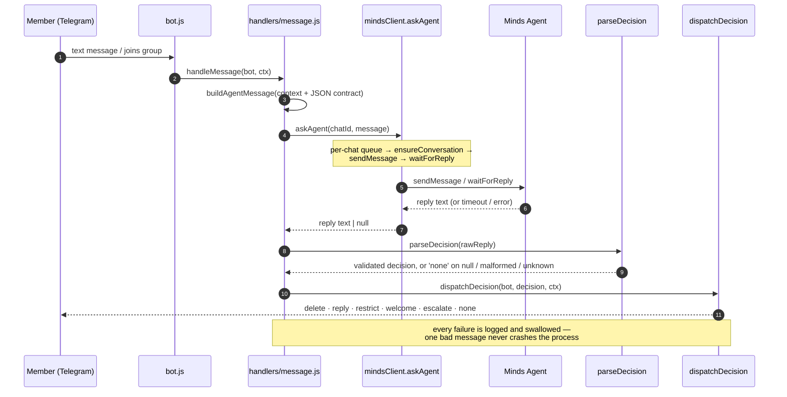

# AEGIS
 
---

## 1. Project Overview

AEGIS is a persistent AI moderator for Telegram communities. It reads a group's messages, decides what — if anything — each one needs, and acts on its own, pulling in a human only for the cases that genuinely need one.

Traditional moderation bots follow fixed rules ("delete any message containing word X"). They can't tell a genuine question from spam, they don't know who anyone is, and they forget everything the moment they restart. AEGIS is built the opposite way: it is backed by a [Minds](https://build.hellominds.ai) agent that gives it long-term memory, so it behaves less like a keyword filter and more like a moderator who has actually been in the room for weeks.

- Learns each community's culture, tone, and unwritten rules over time
- Remembers individual members, past conflicts, and what has already been answered
- Makes context-aware decisions instead of matching keywords
- Acts autonomously, and escalates only the genuinely hard cases

**Goal:** free creators from hours of daily moderation so they can get back to creating, while their community stays healthy and welcoming even when no human is watching.

---

## 2. The Problem We're Solving

Running a busy community chat is a second full-time job, and most of it is the same work on repeat:

- **Hours lost every day** — creators burn 1–3 hours deleting spam, answering the same handful of questions, and smoothing over small flare-ups.
- **Burnout** — it never stops and it is rarely interesting, so it quietly drains the creative energy the community was built for.
- **Blunt tools** — keyword bots either ban too aggressively or miss obvious context; they have no idea who a person is or what was said a minute ago.
- **Lost newcomers** — new members show up with questions nobody has the energy to answer for the hundredth time, so they drift away.
- **Buried knowledge** — the best answer to a recurring question was already written weeks ago, then scrolled out of sight for good.

AEGIS takes the first pass at all of it: it absorbs the repetitive majority of the work, remembers everything, and only brings in a human when a situation actually deserves one.

---

## 3. How It Works

Every message runs through the same short pipeline:

1. **Ingest** — AEGIS receives each new message, and each new member, from Telegram in real time.
2. **Understand context** — before deciding anything, it draws on its persistent memory: who is speaking (a brand-new arrival? a reliable regular? someone with a history?), what has already happened in the conversation, the norms it has learned for this specific community, and how similar situations were handled before.
3. **Decide** — the message is framed for the Minds agent, which returns one structured decision limited to six validated actions: **delete**, **reply**, **restrict**, **welcome**, **escalate**, or **none**. If the reply is missing or malformed, AEGIS falls back to `none` — it never acts on a guess.
4. **Act** — it carries out that decision itself: remove spam, answer with the right information, mute a repeat offender, welcome a newcomer, or deliberately do nothing.
5. **Escalate** — when a case is genuinely sensitive, it hands a clean summary and the full context to the human moderators instead of acting. Every escalation carries a fixed disclaimer that separates the facts AEGIS is sure of from the agent's own narrative, so a human is never misled by a fabricated claim.
6. **Learn** — every decision, action, and piece of human feedback is written back to long-term memory, so the agent grows more accurate and better tuned to the community the longer it runs.

---

## 4. Detailed Features

**A. Persistence — the core**
- **Long-term memory** — remembers individual members, past conflicts, the community rules it has learned, and which interventions actually worked, across days and restarts.
- **Continuity** — when the process restarts, it resumes exactly where it left off; nothing it has learned is lost.
- **Autonomous action** — handles the common cases on its own, without waiting on a human.

**B. Moderation**
- Detects and removes spam, repeated links, and bot-posted content.
- Recognizes repeated questions and answers them by surfacing the earlier good answer.
- Applies gentle, contextual moderation ("let's keep this channel focused on X — here's a better spot for that") instead of blunt bans.
- Escalates with the full conversation history and its own reasoning attached.

**C. Community care**
- Welcomes new members in the community's own tone.
- Surfaces old, still-relevant posts when a familiar question comes up again.
- Keeps quiet track of positive, helpful contributors.

**D. Creator dashboard** *(planned, not yet built)*
- A live view of what the agent is doing, the queue of escalated cases, and memory insights (for example, the week's top recurring questions) — plus a feedback channel the agent can learn from.

---

## 5. Example User Scenarios

**Repeated question.** A new member asks, "How do I join the private group?" AEGIS recognizes the question was answered several times last week, replies with the same correct answer and link, and logs it — no human needed.

**Mild toxicity.** Someone snaps, "You're so dumb for saying that." AEGIS checks the sender's history, sees a normally positive member having a bad moment, and responds with a light nudge about the community's tone rather than reaching for a ban.

**Spam.** A bot dumps five links in ten seconds. AEGIS removes them and mutes the account almost immediately — usually before most of the group has even seen them.

**Complex case.** A heated argument tips into personal attacks. Instead of guessing, AEGIS pauses, gathers the full context, and escalates to a human with a clear summary: what happened across the last several messages, plus the past history between the two people involved.

**Memory over time.** On day one the agent is cautious and checks in often. By day seven it has learned that this community dislikes self-promotion but loves meme sharing, and it adjusts its own behavior to match.

---

## 6. Technical Architecture 

AEGIS is a small, single-process Node.js service. Telegram updates arrive
through Telegraf, every message is framed and handed to the **Minds** agent
for a decision, and only a *validated* decision is ever turned into a
moderation action.

### Component map



### Message workflow




### Key components (all built)

| Module | Responsibility |
|---|---|
| `src/bot/bot.js` | Telegraf wiring — `on('text')`, `on('new_chat_members')`, `bot.catch` |
| `src/bot/launch.js` | Startup that survives a mid-run polling death instead of crashing the process |
| `src/bot/handlers/message.js` | Orchestrates prompt → agent → decision → action; logs and swallows any single-message failure |
| `src/agent/prompt.js` | Frames each message for the Mind and pins the strict JSON response contract |
| `src/agent/mindsClient.js` | Per-chat serialized calls to Minds, with the read/write retry split |
| `src/agent/decision.js` | Validates the agent's reply into an allowed action, else `none` |
| `src/actions/*` | `delete` · `reply` · `restrict` · `welcome` · `escalate` (escalations carry a fabrication disclaimer) |
| `src/config.js`, `src/utils/*` | Required-env loading, structured `pino` logging, retry + balanced-JSON helpers |

**Reliability invariants** (enforced in code, covered by `npm test` — zero secrets, zero network):

- A moderation action is only taken from a *validated* agent decision; a malformed or missing reply degrades to `none`, never a guessed action — `src/agent/decision.js`.
- The non-idempotent `sendMessage` write retries only on a `429`; a `5xx`/timeout is treated as unknown and never retried blind, so a message is never posted twice — `src/agent/mindsClient.js`.
- One bad message is logged and swallowed — it never crashes the bot (`src/bot/handlers/message.js`, `bot.catch`); a mid-run polling death is logged but the process stays alive — `src/bot/launch.js`.
- Every decision and action is emitted as structured JSON via `pino`.

### Repository layout

```text
src/
├── index.js            # main(): start bot, fatal handlers, graceful shutdown
├── config.js           # required-env loading (throws on missing)
├── bot/
│   ├── bot.js          # Telegraf instance + event wiring
│   ├── launch.js       # launchBot(): startup vs. mid-run failure handling
│   └── handlers/
│       └── message.js  # handleMessage / handleNewMember orchestration
├── agent/
│   ├── prompt.js       # message framing + JSON response contract
│   ├── mindsClient.js  # per-chat queue, retry policy, Minds SDK calls
│   └── decision.js     # parseDecision: validate reply → action or 'none'
├── actions/
│   ├── index.js        # dispatchDecision switch
│   ├── deleteMessage.js
│   ├── sendReply.js
│   ├── restrictUser.js
│   ├── welcome.js
│   └── escalate.js     # human escalation + fabrication disclaimer
└── utils/
    ├── helpers.js      # withRetry, sleep, extractJsonObject
    └── logger.js       # pino logger

test/                   # node --test: decision, mindsClient, helpers, escalate, launch
```

**Status:** the core decision pipeline is confirmed working end-to-end against a
live Minds agent — the first fully autonomous moderation action (a contextual
reply) landed on 2026-08-26. Spam/phishing deletion has been reliable in
testing; interpersonal-toxicity handling and `restrict` are not yet reliable,
and reply latency (~28–41s) plus a few operational gaps are tracked honestly in
[`docs/LIMITATIONS.md`](docs/LIMITATIONS.md). Verified SDK behavior notes live
in [`docs/API_NOTES.md`](docs/API_NOTES.md).

---

## 7. How We Prove the Three Required Minds Capabilities

| Capability | How AEGIS demonstrates it |
|---|---|
| **Memory** | The agent recalls a specific member and a conflict from days earlier and factors both into the decision it makes right now. |
| **Continuity** | Restart the process mid-demo and it resumes with its full knowledge of the community intact — nothing is lost. |
| **Autonomous action** | Left running on a live chat, it moderates for a stretch with no human input, taking real actions on its own. |

Autonomous action is not a claim on paper: the first fully autonomous moderation action — a contextual reply — was verified end-to-end against a live Minds agent on 2026-08-26. See [`INTEGRATOR.md`](INTEGRATOR.md) for the integration write-up, and [`docs/LIMITATIONS.md`](docs/LIMITATIONS.md) for an honest account of what is and is not reliable yet.

---

## 8. Setup Instructions

**Prerequisites:** Node.js ≥ 22 and npm. The platform is Telegram (not Discord),
and the backend is Node.js + Telegraf + Minds. See [`docs/API_NOTES.md`](docs/API_NOTES.md)
and [`docs/LIMITATIONS.md`](docs/LIMITATIONS.md) for what has been verified against the
real Minds SDK.

```bash
git clone <this repo's URL>
cd AEGIS

# Install the exact, locked dependencies
npm ci

# Configure
cp .env.example .env
# Fill in:
# - TELEGRAM_BOT_TOKEN      
# - MINDS_BUILDER_API_KEY
# - MINDS_MIND_ID
# - ESCALATION_CHAT_ID

# Verify without any credentials (no secrets or network required)
npm run lint
npm test

# Run
npm start
```

> **Secrets:** `.env` holds real tokens and is gitignored — never commit it.
> `.env.example` documents the required variables with safe placeholder values.

### Starting and stopping the bot

Only one instance can poll Telegram per bot token — starting a second one
while another is running causes a 409 that's logged but silent (see
`docs/LIMITATIONS.md`), so check nothing's already running first.

Foreground (recommended — `Ctrl+C` sends a real `SIGINT`, which runs
AEGIS's own graceful shutdown in `src/index.js`):

```bash
npm start
```

Backgrounded/detached, if you need the terminal back:

```bash
# Bash (Git Bash)
npm start &
tasklist //FI "IMAGENAME eq node.exe"   # find the PID
taskkill //PID <pid> //T //F            # stop it
```

```powershell
# PowerShell
Start-Process npm -ArgumentList "start" -NoNewWindow
Get-Process node                        # find the PID
Stop-Process -Id <pid> -Force
```
