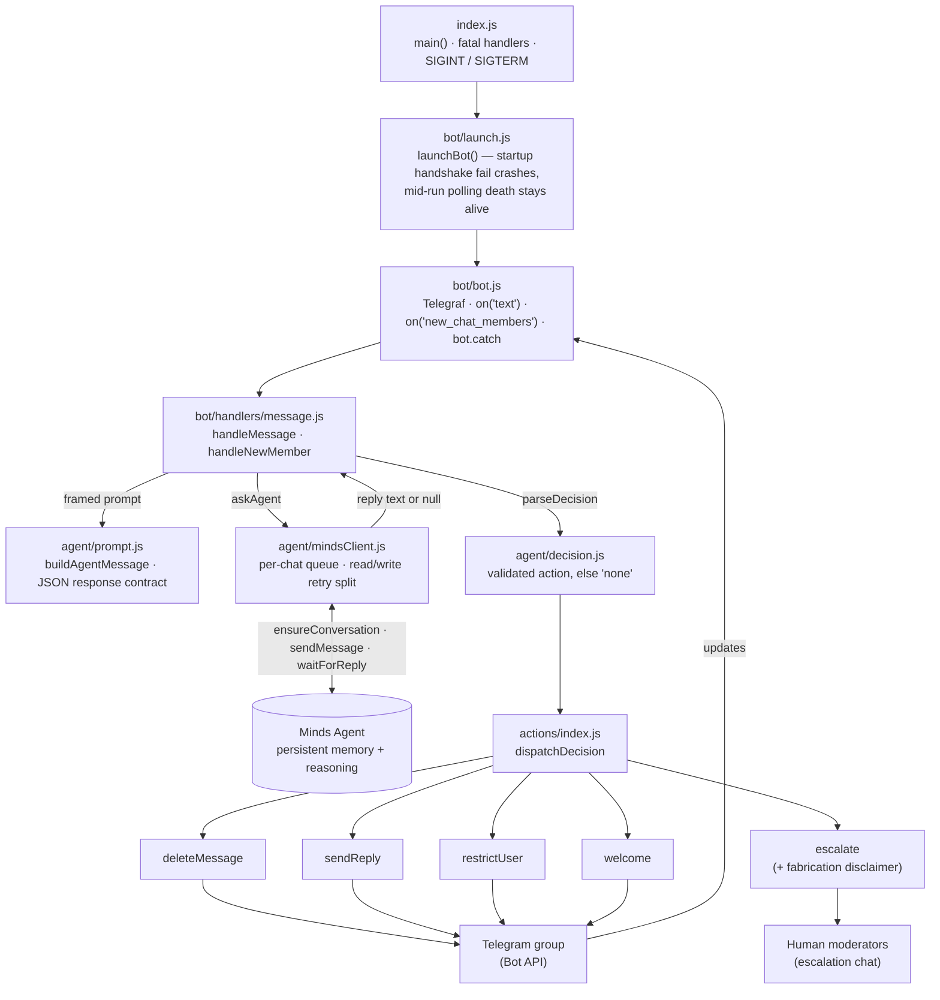
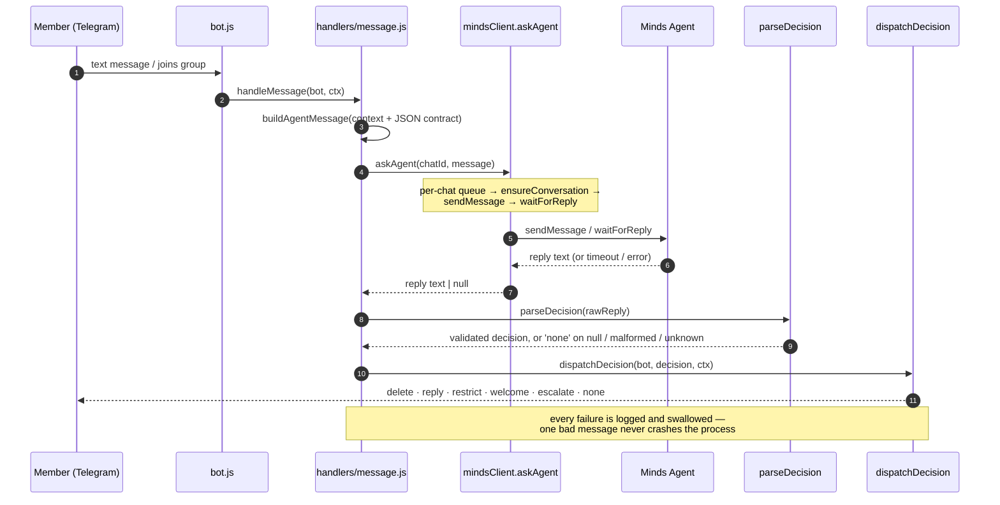

# AEGIS
 
---

## 1. Project Overview 

**AEGIS** is a persistent AI agent that acts as a long-term, intelligent moderator and community caretaker for content creators.

Unlike traditional bots that only follow fixed rules (e.g. “delete messages containing X word”), this agent:

- Learns the unique culture, tone, and unwritten rules of each community over time
- Remembers past conversations, conflicts, and positive members
- Makes context-aware decisions
- Acts autonomously while escalating only the important cases to humans

**Core goal**: Free creators from hours of daily moderation work so they can focus on creating content, while keeping their communities healthy and welcoming.

---

## 2. The Real Problem We Are Solving

Creators who run communities (Discord, Telegram, YouTube Community posts, etc.) face these daily pains:

- Spending 1–3 hours every day deleting spam, answering the same questions repeatedly, and handling mild toxicity
- Losing creative energy and getting burnout
- Current bots are dumb: they either ban too aggressively or miss context
- New members feel lost, veterans get tired of answering the same things
- Important community knowledge (old helpful posts, past resolutions) gets buried

Our agent directly attacks these problems by becoming the community’s permanent memory and first responder.

---

## 3. How It Works 


### Step-by-step process:

1. **Ingest**  
   The agent continuously receives messages from Telegram.

2. **Understand Context**  
   Using its persistent memory, the agent looks at:
   - Who is speaking (new member? known positive member? previous troublemaker?)
   - What has happened in this conversation before
   - Community norms it has learned over days/weeks
   - Similar past situations and how they were resolved

3. **Decide**  
   The agent classifies the message into categories:
   - Spam / Bot
   - Repeated question
   - Mild toxicity / off-topic
   - Positive contribution
   - Complex / sensitive issue

4. **Act Autonomously** (most cases)
   - Delete or hide spam
   - Softly warn for mild issues
   - Reply with the correct answer by surfacing an old helpful post
   - Welcome new members and pair them with veterans
   - Silently log everything for learning

5. **Escalate** (only when needed)
   - Sends a clean summary + full context to the human moderator (creator or trusted mods)
   - Waits for human decision and learns from it

6. **Learn & Improve**
   - Every action and human feedback is stored in the agent’s long-term memory
   - Over time the agent becomes more accurate and gentler/stricter according to the community’s real culture

---

## 4. Detailed Features

### A. Core Persistence Features (Must-have for the hackathon)
- **Long-term Memory**: Remembers individual members, past conflicts, community rules, and successful interventions across days and sessions
- **Continuity**: When the agent restarts, it continues exactly where it left off — no loss of knowledge
- **Autonomous Action**: Performs moderation tasks without waiting for human input most of the time

### B. Moderation Capabilities
- Auto-detect and handle spam / repeated links / bots
- Detect repeated questions and reply with previous good answers
- Contextual soft moderation (e.g. “Hey, we keep this channel focused on X — here’s a better place”)
- Escalation system with full conversation history + agent reasoning

### C. Community Care Features
- Smart welcome messages for new members
- Suggest pairing new members with active veterans
- Surface old helpful posts when relevant questions appear again
- Quietly highlight positive members (optional recognition)

### D. Creator Dashboard (Simple version for MVP)
- Live view of what the agent is doing
- List of escalated cases
- Memory insights (e.g. “Top recurring questions this week”)
- Ability to give feedback so the agent learns faster

---

## 5. Example User Scenarios 

**Scenario 1 – Repeated Question**  
New member: “How do I join the private group?”  
Agent remembers this was answered 4 times last week → Replies with the exact previous answer + link → Logs it.

**Scenario 2 – Mild Toxicity**  
Member A: “You’re so dumb for saying that”  
Agent checks history: Member A is usually positive → Soft warning + reminder of community tone → No ban.

**Scenario 3 – Spam**  
Bot posts 5 links in 10 seconds → Agent immediately removes them and mutes for 10 minutes.

**Scenario 4 – Complex Case**  
Heated argument involving personal attacks → Agent pauses, gathers full context, and escalates to human with a clear summary:  
“Here’s what happened in the last 15 messages + past history between these two members.”

**Scenario 5 – Memory Over Time**  
Day 1: Agent is cautious  
Day 7: Agent already knows the community hates self-promotion but loves meme sharing → Adjusts behavior automatically.

---

## 6. Technical Architecture 

AEGIS is a small, single-process Node.js service. Telegram updates arrive
through Telegraf, every message is framed and handed to the **Minds** agent
for a decision, and only a *validated* decision is ever turned into a
moderation action.

### Component map



### Message workflow




### Key components (all built)

| Module | Responsibility |
|---|---|
| `src/bot/bot.js` | Telegraf wiring — `on('text')`, `on('new_chat_members')`, `bot.catch` |
| `src/bot/launch.js` | Startup that survives a mid-run polling death instead of crashing the process |
| `src/bot/handlers/message.js` | Orchestrates prompt → agent → decision → action; logs and swallows any single-message failure |
| `src/agent/prompt.js` | Frames each message for the Mind and pins the strict JSON response contract |
| `src/agent/mindsClient.js` | Per-chat serialized calls to Minds, with the read/write retry split |
| `src/agent/decision.js` | Validates the agent's reply into an allowed action, else `none` |
| `src/actions/*` | `delete` · `reply` · `restrict` · `welcome` · `escalate` (escalations carry a fabrication disclaimer) |
| `src/config.js`, `src/utils/*` | Required-env loading, structured `pino` logging, retry + balanced-JSON helpers |

**Reliability invariants** (enforced in code, covered by `npm test` — zero secrets, zero network):

- A moderation action is only taken from a *validated* agent decision; a malformed or missing reply degrades to `none`, never a guessed action — `src/agent/decision.js`.
- The non-idempotent `sendMessage` write retries only on a `429`; a `5xx`/timeout is treated as unknown and never retried blind, so a message is never posted twice — `src/agent/mindsClient.js`.
- One bad message is logged and swallowed — it never crashes the bot (`src/bot/handlers/message.js`, `bot.catch`); a mid-run polling death is logged but the process stays alive — `src/bot/launch.js`.
- Every decision and action is emitted as structured JSON via `pino`.

### Repository layout

```text
src/
├── index.js            # main(): start bot, fatal handlers, graceful shutdown
├── config.js           # required-env loading (throws on missing)
├── bot/
│   ├── bot.js          # Telegraf instance + event wiring
│   ├── launch.js       # launchBot(): startup vs. mid-run failure handling
│   └── handlers/
│       └── message.js  # handleMessage / handleNewMember orchestration
├── agent/
│   ├── prompt.js       # message framing + JSON response contract
│   ├── mindsClient.js  # per-chat queue, retry policy, Minds SDK calls
│   └── decision.js     # parseDecision: validate reply → action or 'none'
├── actions/
│   ├── index.js        # dispatchDecision switch
│   ├── deleteMessage.js
│   ├── sendReply.js
│   ├── restrictUser.js
│   ├── welcome.js
│   └── escalate.js     # human escalation + fabrication disclaimer
└── utils/
    ├── helpers.js      # withRetry, sleep, extractJsonObject
    └── logger.js       # pino logger

test/                   # node --test: decision, mindsClient, helpers, escalate, launch
```

**Status:** the core decision pipeline is confirmed working end-to-end against a
live Minds agent — the first fully autonomous moderation action (a contextual
reply) landed on 2026-08-26. Spam/phishing deletion has been reliable in
testing; interpersonal-toxicity handling and `restrict` are not yet reliable,
and reply latency (~28–41s) plus a few operational gaps are tracked honestly in
[`docs/LIMITATIONS.md`](docs/LIMITATIONS.md). Verified SDK behavior notes live
in [`docs/API_NOTES.md`](docs/API_NOTES.md).

---

## 7. MVP Scope for the Hackathon (What we must finish)

**Must have (for strong demo):**
- Working Telegram bot connected to a Minds agent
- Persistent memory that survives restarts
- At least 3 autonomous actions (spam handling, repeated question reply, soft warning)
- Escalation to a human (Telegram DM or private group)
- Clear demonstration of memory across sessions

**Nice to have:**
- Simple web dashboard
- Positive member recognition

**Out of scope for this jam:**
- Multi-language advanced NLP
- Full multi-platform support
- Complex reward systems

---

## 8. How We Prove the Three Required Minds Capabilities

| Capability       | How we demonstrate it in the demo video |
|------------------|-----------------------------------------|
| Memory           | Show the agent remembering a member and past conflict from 3 days ago |
| Continuity       | Restart the agent mid-demo → it continues with full knowledge |
| Autonomous Action| Let the agent moderate live for 30–60 seconds without human input |

---

## 11. Setup Instructions (for teammates)

The platform is Telegram (not Discord — see `backend_implementation.md`),
and the backend is Node.js + Telegraf + Minds. See `docs/API_NOTES.md` and
`docs/LIMITATIONS.md` for what's been verified against the real Minds SDK.

```bash
git clone <this repo's URL>
cd AEGIS

# Install dependencies
npm install

# Configure
cp .env.example .env
# Fill in:
# - TELEGRAM_BOT_TOKEN   (from @BotFather)
# - MINDS_BUILDER_API_KEY
# - MINDS_MIND_ID
# - ESCALATION_CHAT_ID

# Verify without any credentials (no secrets/network required)
npm run lint
npm test

# Run
npm start
```

### Starting and stopping the bot

Only one instance can poll Telegram per bot token — starting a second one
while another is running causes a 409 that's logged but silent (see
`docs/LIMITATIONS.md`), so check nothing's already running first.

Foreground (recommended — `Ctrl+C` sends a real `SIGINT`, which runs
AEGIS's own graceful shutdown in `src/index.js`):

```bash
npm start
```

Backgrounded/detached, if you need the terminal back:

```bash
# Bash (Git Bash)
npm start &
tasklist //FI "IMAGENAME eq node.exe"   # find the PID
taskkill //PID <pid> //T //F            # stop it
```

```powershell
# PowerShell
Start-Process npm -ArgumentList "start" -NoNewWindow
Get-Process node                        # find the PID
Stop-Process -Id <pid> -Force
```